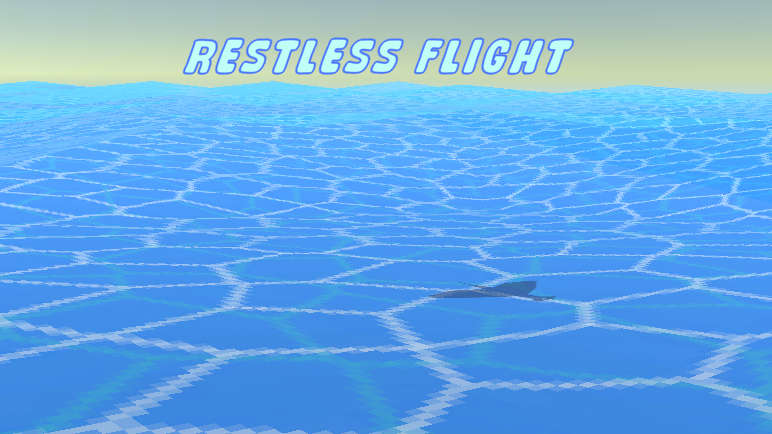

# Restless Flight
 Submission to the Games Job Fair: Unity Programming Challenge
 The Prompt Of the Challenge was "Infinite Runner" and this was my submission.
 
 

This submission was made in a matter of 7 days and speaking with hindsight, I wish I had started sooner!

### On to the interesting parts:
- The Bird's movements work through a finite state machine (FSM) to handle specific behaviours in their appropriate states.
[*You can look through the code here*](Assets/Scripts/BirdStates/BirdStateMachine.cs).
- The Water Shader was made through Shader Graph which was very intuitive once you got the hang of things and in the game gives a beautiful water effect with a rippling effect to make the waves themselves.
[*Here is a link to the shader folder*](Assets/Shaders).
- My favorite part of this project was figuring out a way on how to "Move" the bird so that it can give the illusion of movement without actually moving from the origin point. This involved a different method on scrolling the sea texture so that the illusion would almost be seamless from the real thing.
[*You can take a look at the script itself that was managing that process, it might not be beautiful!*](Assets/Scripts/WorldManager.cs).

### Extra Notes:
This project doesn't have much to show and can definitely use improvements on the code (*Especially with my GameManager script which only handles the ending of the game and nothing else*), but there were new methods put to use when making a infinite runner that challenged my previous understanding of the genre and gave another angle it's approach. In the end, what I am trying to say is it's good to challenge yourself, because you end up getting more experience or knowledge in the process.

Thank you for reading!

